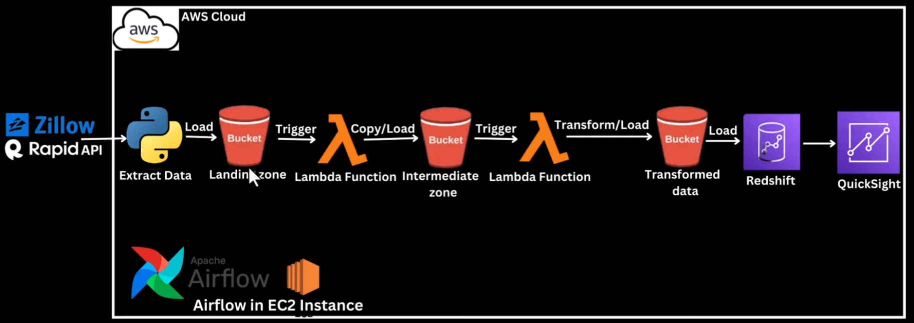
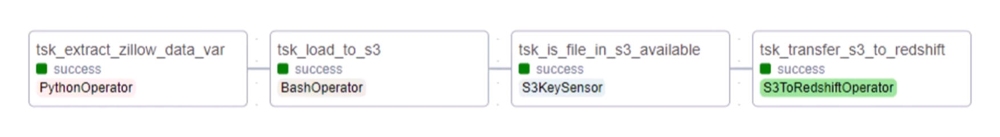
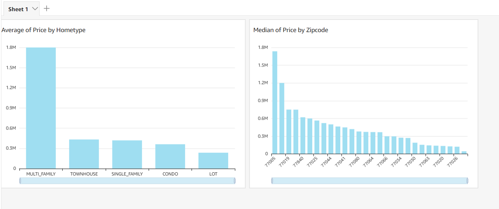

# Zillow_Data_Analytics
 
## Overview

In This project, we build and automate a python ETL process that would extract real estate properties data from Zillow Rapid API

## Project Goals

This project would extract real estate properties data from Zillow Rapid API, loads it unto amazon s3 bucket which then triggers a series of lambda functions which then ultimately transforms the data, converts into a csv file format and load the data into another S3 bucket using Apache Airflow. Apache airflow will utilize an S3KeySensor operator to monitor if the transformed data has been uploaded into the aws S3 bucket before attempting to load the data into an amazon redshift. 
After the data is loaded into aws redshift, then connect to amazon quicksight to the redshift cluster to then visualize the Zillow (rapid data) data.
Apache Airflow is an open-source platform used for orchestrating and scheduling workflows of tasks and data pipelines. This project will entirely be carried out on AWS cloud platform.

## Services we will be using
1. Amazon S3: Amazon S3 is an object storage service that provides manufacturing scalability, data availability, security, and performance.
2. AWS IAM: This is nothing but identity and access management which enables us to manage access to AWS services and resources securely.
3. QuickSight: Amazon QuickSight is a scalable, serverless, embeddable, machine learning-powered business intelligence (BI) service built for the cloud.
4. AWS Lambda: Lambda is a computing service that allows programmers to run code without creating or managing servers.
5. AWS EC2: launch as many or as few virtual servers as you need, configure security and networking, and manage storage. And We deploy the Airflow DAG in the created EC2 instance.
6. AWS RedShift: analyze structured and semi-structured data across data warehouses, operational databases, and data lakes.
## Architecture Diagram

## Dags process (Airflow)

## DashBoard (in AWS QuickSight)

